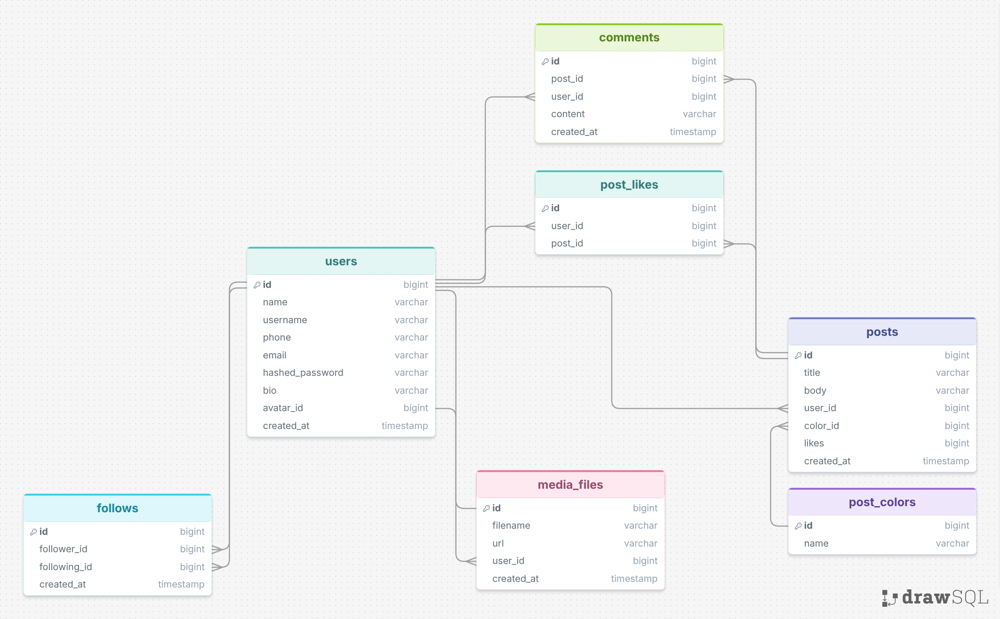

# 🌿 Peel (Back-end)

  

O **Peel** é uma rede social baseada na simplicidade dos *post-its*. Este repositório concentra a inteligência do ecossistema, expondo uma API robusta, assíncrona e performática.

## Arquitetura e Tecnologias

O projeto foi construído utilizando **FastAPI (Python)** para a criação de rotas rápidas e assíncronas, e **PostgreSQL** como banco de dados relacional.

A API foi estruturada seguindo rigorosamente o padrão CSR (**Controller-Service-Repository**):

*   **Controllers (Rotas/Routers):** Funcionam como a porta de entrada da aplicação. Eles recebem as requisições HTTP do FastAPI, validam os dados de entrada (geralmente usando Pydantic) e apenas chamam os serviços necessários, sem conhecer as regras de negócio ou de banco.
*   **Services (Serviços):** É o coração da aplicação. Onde reside toda a lógica de negócios da rede social (como regras para criar um post-it, interações e validações de usuários). Eles orquestram o fluxo antes de enviar os dados para a persistência.
*   **Repositories (Repositórios):** A camada isolada responsável estritamente pelo acesso ao banco de dados. Ela executa as consultas SQL ou operações do ORM no PostgreSQL, garantindo que o resto do código não precise saber como os dados são salvos.

Essa abordagem — combinada com a poderosa injeção de dependências do FastAPI — garante que o código seja altamente testável, modular, fácil de manter e pronto para escalar.

## 📊 Modelagem do Banco de Dados

A estrutura e o relacionamento das tabelas do PostgreSQL foram mapeados no DrawSQL:

🔗 [Acessar versão interativa no DrawSQL](https://drawsql.app/teams/antonio-pereira/diagrams/peel/embed)



## 🔒 Variáveis de Ambiente

O projeto utiliza o [**Cloudinary**](https://cloudinary.com/) para armazenamento de mídia e **JWT** para autenticação. Na raiz do projeto, você encontrará um arquivo chamado **.env.example**.

Duplique esse arquivo, renomeie a cópia para **.env** e preencha com as suas credenciais locais e do Cloudinary (como **DATABASE_URL**, **chaves do Cloudinary** e a **SECRET_KEY**).

## 🛠️ Executando o projeto

Para rodar o back-end localmente na sua máquina, siga os passos abaixo:

```cmd
    cd peel-backend

    # Instale as dependências necessárias:
    pip install -r requirements.txt

    # Inicialize o servidor de desenvolvimento do FastAPI:
    uvicorn main:app --reload
```

A API estará disponível por padrão em http://127.0.0.1:8000 e a documentação interativa automática (Swagger UI) em http://127.0.0.1:8000/docs.

---
Desenvolvido por [Antonio Candioto](https://github.com/antoniolpcan) — Entre em contato no [LinkedIn](https://www.linkedin.com/in/antoniolpcan/)
